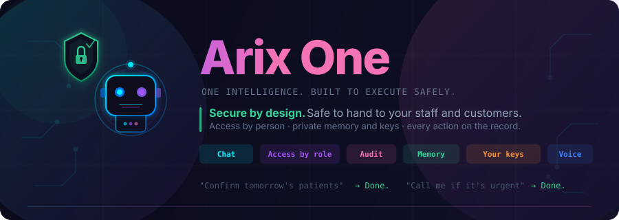
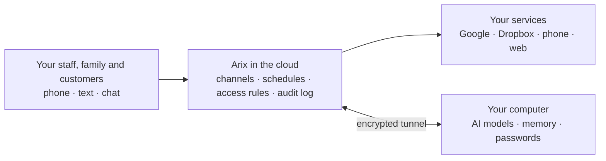

  

<h3 align="center">The AI assistant you can safely hand to your staff and your customers.</h3>

<a href="https://arixone.com/#early-access"><strong>Join the waitlist →</strong></a> · <a href="https://x.com/TheArixOne">Follow @TheArixOne on X</a>

Arix answers your phone, texts, chats and email. It books, reminds, follows up and remembers. It is built for a
business with real people and real data, so everyone gets only the access you give them, private things stay
private, and every action leaves a record.

---

## Why Arix exists

AI assistants that act for you now come in two kinds, and neither fits a business very well.

**Do-it-yourself agents** are powerful and free to run on your own machine. But they're built for one technical
person, and you become the security team. Access is all or nothing, add-ons come from strangers, and keeping it
always on means keeping a computer exposed to the internet.

**Big-platform agents** are polished and easy to start. But your assistant, its memory of you and your customers,
and the data it works with live on someone else's platform. You get their AI, their rules, the countries they
serve, and their promise not to look.

**Arix is the third kind: an assistant your business owns.** It's built for a team. Your conversations, memory,
passwords and AI models stay on your own computer, and it isn't locked to any one company's platform.

> Other assistants are a product you join. Arix is an assistant your business owns.

| | How Arix handles it |
|---|---|
| **Access by person** | Every person has a role and only the services you grant. Staff, family and customers each see exactly their part. |
| **Private memory** | Arix remembers each person separately. Nobody's questions ever reach someone else's memories. |
| **Your keys stay yours** | AI models, memory and passwords live on your own computer, in its keychain, not in someone's cloud. |
| **Actions you can trust** | The AI decides; plain, tested code does the work. Every reply is checked against what actually happened, to catch claims of things that never ran. |
| **On the record** | Sign-ins, changes, refusals and every conversation are logged, per person. |
| **No add-on roulette** | Capabilities are reviewed and built in, not downloaded from a public marketplace. |
| **Reachable, not exposed** | The phone line and chat are always up in the cloud; your computer is never opened to the internet. |
| **Your choice of AI** | Use private models on your own computer or any major provider, and switch whenever you like. |
| **No middleman** | No platform takes a cut of what your assistant does or decides what it's allowed to do. |

---

## Talk to it wherever you are

| Channel | What it's like |
|---|---|
| **Phone** | A real number. Callers are recognised, and Arix can call you when something can't wait. |
| **Text** | iMessage and Telegram. Arix can also text people for you and bring their reply back. |
| **Chat app** | A fast web chat that installs on your phone's home screen. |
| **Dashboard** | Manage people, services, memory and schedules from the browser. |

Every channel has the same abilities. A phone call is not a lesser mode.

> *"Confirm tomorrow's patients and tell me who hasn't answered by noon."*
>
> *"Text Sam that I'm running 10 minutes late and tell me what he says."*
>
> *"Every weekday at 7, check the inbox and send me a summary."*
>
> *"Call me if the Henderson contract comes back signed."*

---

## Built for your business

The core is the same for everyone. What makes Arix fit is the services you connect, the processes you describe and
the knowledge you give it: your policies, price lists and tone of voice.

| Business | What Arix does there |
|---|---|
| **Dental practice** | Answers the phone after hours, books and confirms appointments, texts reminders the day before, and sends the recall list every Monday. |
| **Law firm** | Keeps matter notes, drafts engagement letters from your templates, tracks filing deadlines and summarises new email from opposing counsel. |
| **Real estate** | Answers listing enquiries by text and phone, sends new matches to buyers, books showings and keeps every lead followed up. |
| **Accounting firm** | Collects client documents, chases what's missing before a deadline and drafts the monthly close checklist. |
| **Home services** | Takes job requests by phone, quotes from your price list, schedules the crew and texts the customer when they're on the way. |
| **Just you** | A morning brief, inbox triage, errands by text, a memory that knows your preferences, and a call when something can't wait. |

---

## Services: the building blocks

Everything Arix connects to is a **service**. Switch it on, connect it, and choose exactly who may use it.

| Service | What it adds |
|---|---|
| **Phone (Twilio)** | A number people can call, and calls Arix can place |
| **Telegram** | A chat channel, plus alerts and progress updates |
| **Google Workspace** | Gmail, Docs and Sheets |
| **Dropbox** | Files, sharing and backups |
| **Scheduler** | Recurring jobs in plain language: reports, reminders, follow-ups |
| **Local models** | AI that runs privately on your own computer |

A connection to your own systems, such as your practice software, CRM or booking tool, becomes one more service,
with the same per-person access and the same record.

---

## What it can do

- **Answer and act**: search the web, read and send email, work in Docs and Sheets, file things in Dropbox.
- **Use the web for you**: open pages, fill in forms, take screenshots.
- **Reach people**: texts and phone calls, in and out.
- **Work in the background**: hand off a task, let Arix ask a question halfway through, and get notified when it's
  done. Recurring jobs are set up in plain language.
- **Remember what matters**: preferences and facts per person, with "remember this", "forget that" and "pin that" in
  any channel, and everything reviewable and editable.
- **Get better at your routines**: Arix writes down how it handled something new so it does it the same way next
  time.

---

## Your choice of AI

Each kind of work, whether conversation, writing, research, images or browsing, can use whichever model you
prefer. That can be private models on your own computer, or Anthropic, OpenAI, Google Gemini, xAI, DeepSeek or
Perplexity. Arix routes each task to the right one and switches automatically if one is unavailable.

---

## How it fits together

- **In the cloud**: the parts that must answer at any hour, such as the phone line, chat and schedules, along with
  the access rules and the audit log.
- **On your computer**: the parts that should never leave your hands, such as the AI models, everyone's memory and
  your passwords, kept in your computer's keychain.

Every change to Arix is tested automatically before it goes live, and everything is backed up nightly.

---

<a href="https://arixone.com/#early-access"><strong>Join the waitlist at arixone.com →</strong></a> Follow along on X: <a href="https://x.com/TheArixOne">@TheArixOne</a>

---

Copyright (c) 2026 Arix One. All rights reserved. Arix One is proprietary software; this repository contains
documentation only.
