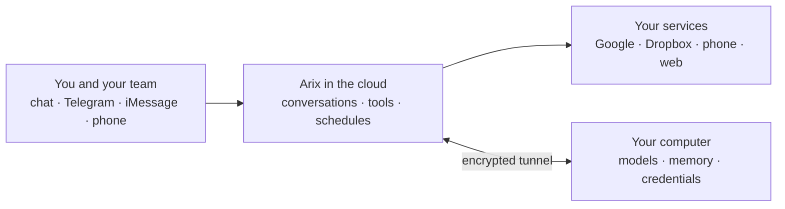

  

<strong>One intelligence. Built to execute safely.</strong>

<a href="https://arixone.com/#early-access"><strong>Join the waitlist →</strong></a>

Arix is a personal AI assistant that actually does things. You talk to it from a chat app, Telegram, iMessage or
the phone. It remembers you, uses around a hundred tools, browses the web, handles email and documents, runs your
schedule, and texts or calls you when something needs you.

It runs in the cloud, but the models, your memory and your credentials stay on your own computer.

---

## Why it's built this way

Language models are great at reasoning and bad at reliability. 90% accuracy per step sounds fine until you chain
five steps together: 0.9⁵ ≈ **59%**.

So Arix splits the work:

- **The model decides**: what you want, which tool to use, what to say.
- **Plain code executes**: sending the email, booking the appointment, writing the file.

The model never runs business logic itself. Every reply is checked against what the tools actually did, so Arix
doesn't claim it sent something it didn't. Permissions are enforced by the system rather than requested from the
model.

---

## Talk to it wherever you are

| Channel | What it's like |
|---|---|
| **Chat app** | A fast, streaming chat on the web, installable on your phone's home screen. |
| **Telegram** | Full conversations, progress updates on long tasks, and alerts. |
| **iMessage** | Text Arix like a person. It can also text people for you and pass their reply back. |
| **Phone** | Call Arix, or have it call you. Voice has every capability chat has. |
| **Dashboard** | Manage people, services, memory and schedules from the browser. |

> *"What's on my calendar tomorrow, and did the contract from Dana come in?"*
>
> *"Text Sam that I'm running 10 minutes late and tell me what he says."*
>
> *"Every weekday at 7, check my inbox and send me a summary."*
>
> *"Pin that — I take my coffee black."*

---

## What it can do

- **Search and read the web** for anything time-sensitive.
- **Email and documents**: Gmail, Google Docs and Sheets, Dropbox.
- **Browse for you**: open pages, fill in forms, take screenshots.
- **Your stuff**: photos, lists and your notes vault, with private notes kept off-limits.
- **Reach people**: send texts and place phone calls.
- **Work in the background**: hand off a task, let Arix ask you a question halfway through, and get notified when
  it's done. Schedule recurring jobs in plain language.
- **Get better over time**: Arix writes down how it solved something new so it can do it again next time.

---

## Services: the building blocks

Everything Arix connects to is a **service**: switch it on, connect it, and choose who gets to use it.

| Service | What it adds |
|---|---|
| **Telegram** | A chat channel, plus alerts and progress updates |
| **Phone (Twilio)** | A number people can call, and calls Arix can place |
| **Local models** | AI that runs on your own computer, privately |
| **Scheduler** | Recurring jobs: reports, reminders, follow-ups |
| **Google Workspace** | Gmail, Docs and Sheets |
| **Dropbox** | Files, sharing and backups |

A connection to your own systems, such as a CRM, a booking tool or an internal database, is just another service.

---

## Make it yours

The core is the same for everyone. What makes Arix fit your business is the services you connect, the processes you
describe and the knowledge you give it: your policies, price lists and tone of voice.

| Business | What Arix does there |
|---|---|
| **Dental practice** | Answers the phone after hours, books and confirms appointments, texts reminders the day before, and sends the recall list every Monday. |
| **Law firm** | Keeps matter notes, drafts engagement letters from your templates, tracks filing deadlines and summarises new email from opposing counsel. |
| **Real estate** | Answers listing enquiries by text and phone, sends new matches to buyers, books showings and keeps every lead followed up. |
| **Accounting firm** | Collects client documents, chases what's missing before a deadline and drafts the monthly close checklist. |
| **Home services** | Takes job requests by phone, quotes from your price list, schedules the crew and texts the customer when they're on the way. |
| **Just you** | A morning brief, inbox triage, errands by text, a memory that knows your preferences, and a call when something can't wait. |

---

## Memory that's actually yours

- Arix remembers each person separately. Nobody else's searches ever see your memories.
- A small model decides what's worth keeping, and a nightly clean-up merges duplicates and retires stale facts.
- "Remember this", "forget that" and "pin that" work in any channel, and you can review and edit everything.
- Your memory lives on your computer, not in the cloud.

---

## Any model, your choice

Every job, whether conversation, coding, research, vision or browsing, can use whichever model you prefer. That
can be local models on your own computer, or Anthropic, OpenAI, Google Gemini, xAI, DeepSeek or Perplexity. Arix
routes each task to the right one and falls back automatically if one is unavailable.

---

## How it fits together

- **In the cloud**: the parts that need to be reachable at any hour, such as the channels, the scheduler and the
  connections to your services.
- **On your computer**: the parts that should stay private, such as the AI models, your memory and your
  passwords, which stay in your computer's keychain.

---

## Built with care

- **People and permissions**: every person gets exactly the services and access you grant, and nothing else.
- **Security checks**: built-in audits, safe defaults, and a log of who did what.
- **Shipped carefully**: every change is tested automatically before it goes live.

---

<a href="https://arixone.com/#early-access"><strong>Join the waitlist at arixone.com →</strong></a>

---

Copyright (c) 2026 Arix One. All rights reserved. Arix One is proprietary software; this repository contains
documentation only.
